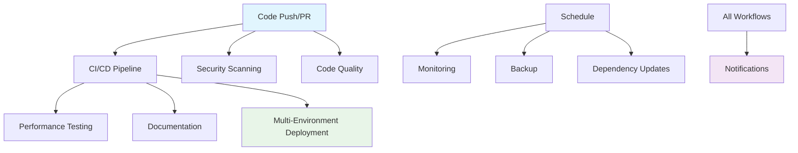

# 🚀 GitHub Actions 工作流体系

本项目采用了完整的 GitHub Actions 工作流体系，实现了从开发到部署的全流程自动化。

## 📋 工作流概览

### 🔄 核心工作流

| 工作流 | 文件 | 触发条件 | 主要功能 |
|--------|------|----------|----------|
| **CI/CD Pipeline** | `ci-cd.yml` | Push, PR, Release | 持续集成和持续部署 |
| **Security Scanning** | `security.yml` | Push, PR, Schedule | 安全扫描和漏洞检测 |
| **Performance Testing** | `performance.yml` | Push, PR, Schedule | 性能测试和基准测试 |
| **Code Quality** | `code-quality.yml` | Push, PR, Schedule | 代码质量检查 |
| **Multi-Environment Deployment** | `deploy.yml` | Push, Release, Manual | 多环境部署 |
| **Monitoring & Alerts** | `monitoring.yml` | Schedule, Manual | 监控和告警 |
| **Backup & Recovery** | `backup.yml` | Schedule, Manual | 备份和恢复 |
| **Documentation** | `docs.yml` | Push, PR, Release | 文档生成和部署 |
| **Dependency Updates** | `dependency-update.yml` | Schedule, Manual | 依赖更新管理 |
| **Notifications & Integrations** | `notifications.yml` | Workflow events, Schedule | 通知和集成 |

## 🎯 工作流详细说明

### 1. CI/CD Pipeline (`ci-cd.yml`)

**触发条件：**
- Push 到任何分支
- Pull Request 到 main/develop 分支
- Release 发布
- 手动触发

**主要功能：**
- 🔍 代码检查（ESLint, Prettier）
- 🧪 单元测试和集成测试
- 📦 构建和打包
- 🚀 自动部署
- 📊 测试覆盖率报告
- 🔒 安全扫描

**环境支持：**
- Development
- Staging
- Production

### 2. Security Scanning (`security.yml`)

**触发条件：**
- Push 到 main/develop 分支
- Pull Request
- 每日定时扫描
- 手动触发

**安全检查：**
- 🔍 依赖漏洞扫描（npm audit, Snyk）
- 🔒 代码安全分析（CodeQL, Semgrep）
- 🕵️ 敏感信息检测（GitLeaks）
- 🛡️ 容器安全扫描（Trivy）
- 📋 安全报告生成

### 3. Performance Testing (`performance.yml`)

**触发条件：**
- Push 到 main 分支
- Pull Request（性能相关变更）
- 每周定时测试
- 手动触发

**性能测试：**
- ⚡ 单元测试性能基准
- 🚀 负载测试（Artillery, Autocannon）
- 💾 内存和 CPU 分析（Clinic.js, 0x）
- 📈 性能回归检测
- 📊 性能报告生成

### 4. Code Quality (`code-quality.yml`)

**触发条件：**
- Push 和 Pull Request
- 每日定时检查
- 手动触发

**质量检查：**
- 🎨 代码风格检查（ESLint, Prettier）
- 🔍 代码复杂度分析
- 📊 测试覆盖率分析
- 🚪 质量门禁
- 📈 质量趋势分析

### 5. Multi-Environment Deployment (`deploy.yml`)

**触发条件：**
- Push 到特定分支
- Release 发布
- 手动触发

**部署策略：**
- 🔄 标准部署
- 🔵🟢 蓝绿部署
- 🐦 金丝雀部署
- ↩️ 回滚部署

**环境映射：**
- `develop` → Development
- `staging` → Staging
- `main` → Production
- `release/*` → Staging
- `hotfix/*` → Production

### 6. Monitoring & Alerts (`monitoring.yml`)

**触发条件：**
- 每小时健康检查
- 每日监控报告
- 手动触发

**监控内容：**
- 🏥 服务健康检查
- ⚡ 性能监控
- 🔒 安全监控
- 💾 资源监控
- 🚨 告警处理

### 7. Backup & Recovery (`backup.yml`)

**触发条件：**
- 每日增量备份
- 每周完整备份
- 手动触发

**备份内容：**
- 📁 源代码备份
- ⚙️ 配置文件备份
- 🗄️ 数据库备份（模拟）
- 📝 日志备份
- 🔄 恢复操作

### 8. Documentation (`docs.yml`)

**触发条件：**
- Push 到 main/develop（文档相关变更）
- Pull Request 到 main
- Release 发布
- 手动触发

**文档生成：**
- 📚 API 文档
- 📖 JSDoc 文档
- 📊 测试覆盖率文档
- 📝 变更日志
- 🌐 文档站点部署

### 9. Dependency Updates (`dependency-update.yml`)

**触发条件：**
- 每周定时检查
- 手动触发

**更新管理：**
- 🔍 过期依赖检查
- 🔒 安全更新自动应用
- 📦 依赖版本更新
- 🚨 主要版本更新提醒
- 📋 依赖分析报告

### 10. Notifications & Integrations (`notifications.yml`)

**触发条件：**
- 其他工作流完成
- Issue/PR 事件
- Release 发布
- 定时报告

**通知渠道：**
- 💬 Slack 集成
- 🎮 Discord 集成
- 👥 Microsoft Teams 集成
- 📧 邮件通知

## 🔧 配置要求

### 必需的 Secrets

```bash
# 容器注册表
GHCR_TOKEN=<GitHub Container Registry Token>

# 通知集成
SLACK_WEBHOOK_URL=<Slack Webhook URL>
DISCORD_WEBHOOK_URL=<Discord Webhook URL>
TEAMS_WEBHOOK_URL=<Microsoft Teams Webhook URL>

# 邮件配置
EMAIL_SMTP_HOST=<SMTP Host>
EMAIL_SMTP_PORT=<SMTP Port>
EMAIL_USERNAME=<Email Username>
EMAIL_PASSWORD=<Email Password>

# 安全扫描
SNYK_TOKEN=<Snyk API Token>
CODECOV_TOKEN=<Codecov Token>

# 部署配置
DEPLOY_SSH_KEY=<SSH Private Key>
DEPLOY_HOST=<Deployment Host>
DEPLOY_USER=<Deployment User>
```

### 可选的 Secrets

```bash
# 性能监控
DATADOG_API_KEY=<Datadog API Key>
NEW_RELIC_LICENSE_KEY=<New Relic License Key>

# 错误追踪
SENTRY_DSN=<Sentry DSN>

# 云服务
AWS_ACCESS_KEY_ID=<AWS Access Key>
AWS_SECRET_ACCESS_KEY=<AWS Secret Key>
AZURE_CREDENTIALS=<Azure Service Principal>
```

## 🚀 快速开始

### 1. 启用工作流

1. 确保所有工作流文件都在 `.github/workflows/` 目录中
2. 配置必需的 repository secrets
3. 推送代码到仓库触发工作流

### 2. 自定义配置

根据项目需求修改工作流配置：

```yaml
# 修改触发条件
on:
  push:
    branches: [ main, develop, feature/* ]
  pull_request:
    branches: [ main ]

# 修改环境变量
env:
  NODE_VERSION: '18'
  PROJECT_NAME: 'Your Project Name'
```

### 3. 监控工作流

- 查看 Actions 页面监控工作流状态
- 配置通知接收工作流结果
- 定期检查生成的报告和文档

## 📊 工作流依赖关系



## 🔍 故障排除

### 常见问题

1. **工作流失败**
   - 检查 Actions 页面的详细日志
   - 验证 secrets 配置是否正确
   - 确认分支保护规则设置

2. **通知未收到**
   - 验证 webhook URL 配置
   - 检查通知渠道的权限设置
   - 查看工作流日志中的错误信息

3. **部署失败**
   - 检查部署环境的连接性
   - 验证部署凭据和权限
   - 查看部署目标的资源状态

### 调试技巧

1. **启用调试日志**
   ```yaml
   env:
     ACTIONS_STEP_DEBUG: true
     ACTIONS_RUNNER_DEBUG: true
   ```

2. **使用 tmate 进行远程调试**
   ```yaml
   - name: Setup tmate session
     uses: mxschmitt/action-tmate@v3
     if: failure()
   ```

3. **手动触发工作流进行测试**
   - 使用 `workflow_dispatch` 事件
   - 配置输入参数进行特定测试

## 📈 最佳实践

### 1. 工作流优化

- 使用缓存减少构建时间
- 并行执行独立的作业
- 合理设置超时时间
- 使用条件执行避免不必要的运行

### 2. 安全考虑

- 最小权限原则配置 secrets
- 定期轮换敏感凭据
- 使用环境保护规则
- 审查第三方 Actions 的安全性

### 3. 监控和维护

- 定期检查工作流执行状态
- 监控资源使用情况
- 及时更新 Actions 版本
- 保持文档同步更新

## 🤝 贡献指南

1. Fork 本仓库
2. 创建功能分支
3. 提交变更
4. 创建 Pull Request
5. 等待代码审查

## 📄 许可证

本项目采用 MIT 许可证 - 查看 [LICENSE](../LICENSE) 文件了解详情。

## 🆘 支持

如果您遇到问题或有建议，请：

1. 查看 [Issues](../../issues) 页面
2. 创建新的 Issue
3. 联系项目维护者

---

*此文档由 GitHub Actions 自动维护和更新*